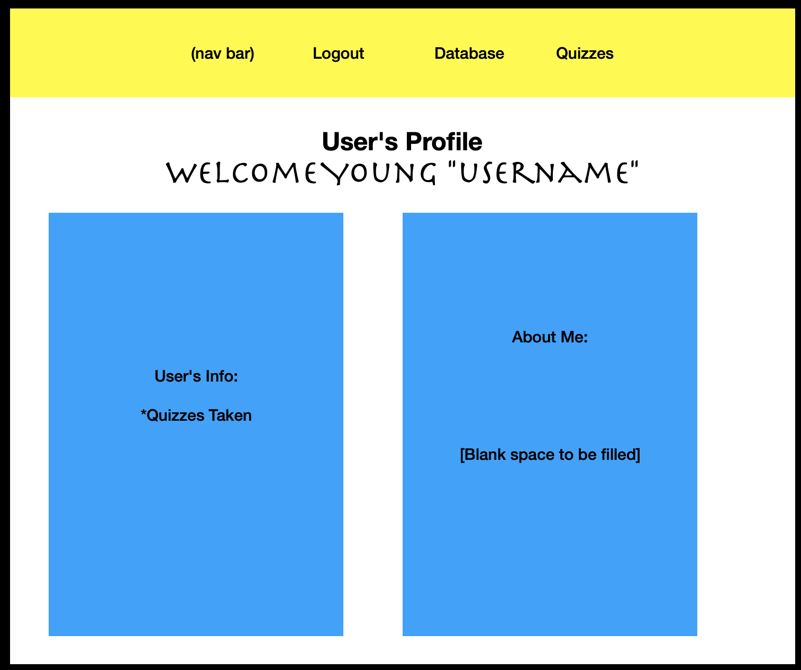
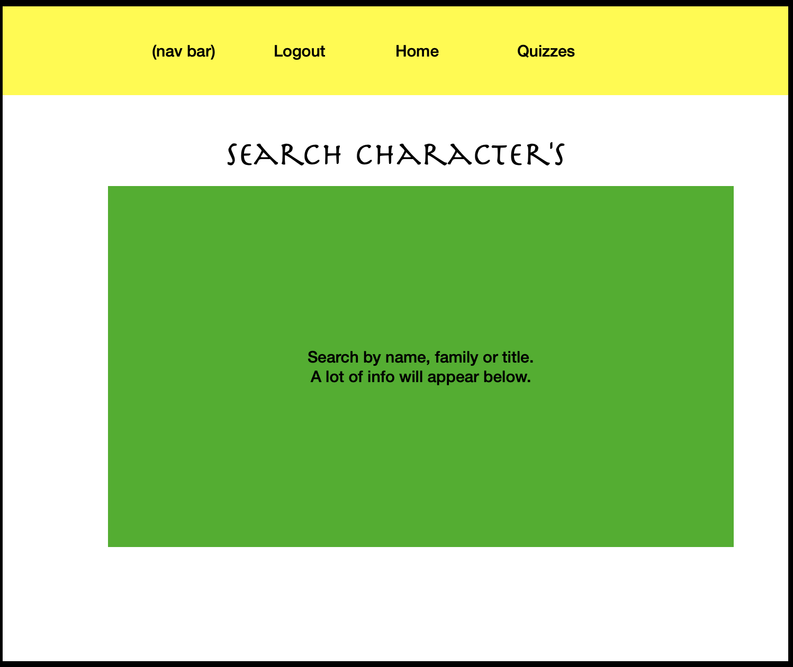

# Casterly Rock Official Municipal Website

## The Only True Throne of Westeros 

### "Fools look at the Westerlands & see gold. Fools see our wealth & call it strength. Gold is just another rock. The Westerlands are strong because of House Lannister. From strong leadership comes unity; from unity comes power." ―Tywin Lannister

### An API of Ice & Fire: https://anapioficeandfire.com/

# ⚔️ ⚔️ 👑 ⚔️ ⚔️

# Overview:

This website should read as an public website for Casterly Rock, run by the Lannister family. Users can personalize their info, enjoy access to Game of Thrones data, quizzes & perhaps even be able to build their own character. My styling, if stretch is reached, will be a municipal website blatantly run by House Lannister. Lots of propaganda, ads & the shabby look of real bureaucratic city websites.

# MVP:

⚔️ Let user's create a profile, & login/logout.

⚔️ Save user's content: username & additional info from site use.

⚔️ Make characters searchable, display info about them.

# Stretch Goals:

⚔️ Let other users comment on other users' posts.

⚔️ Create a few quizzes. Not all true or false.

⚔️ Let users create their own characters that are saved to their profile & the database.

⚔️ Extra CSS styling to make the website look more like a city's public website.

⚔️ Create a very simple quiz, that will be a few questions long, have multiple choice answers & will end with a loss or win.

# Schematic/ERD:

# Wireframe:

# User Story:

1. The first page you see, as a user, is the login page.
2. At this page you choose to either...

   A. create a user account, enter in a username & password.

   B. login to an already existing account.

3. The next page the logged in user will see is their home page.
4. Once logged in, the user will always have the navigation bar at the top of the page.
5. The user can use the navigation bar to do 3 things from their home page.

   A. Log out-- this brings you back to an empty login page.

   B. Database-- the user can search the API.

   C. Search-- user can search through characters by name. Then save them to their homepage.

# Sources Used:

⚔️ An API of Ice And Fire: https://anapioficeandfire.com/  
⚔️ Game of Thrones Fandom Wiki: https://gameofthrones.fandom.com  
⚔️ DB Schema designer: https://app.dbdesigner.net/designer  

